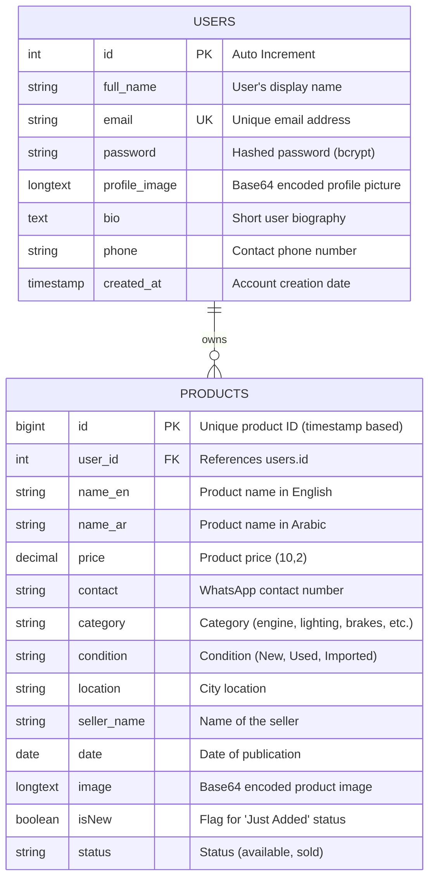

# AutoParts Hub - Database Structure (ERD)

This document describes the database schema for the AutoParts Hub car parts marketplace. The database uses **MySQL**.

## Entity Relationship Diagram (ERD)

## Table Details

### 1. `users` Table
Stores user account information and profile details.
- **id**: Primary Key, auto-incremented integer.
- **email**: Unique index to prevent duplicate accounts.
- **password**: Stored as a secure hash using `bcryptjs`.

### 2. `products` Table
Stores all car parts listed on the marketplace.
- **id**: Primary Key, uses a large integer (usually `Date.now()`).
- **user_id**: Foreign Key linking to the `users` table. If a user is deleted, their products are automatically removed (`ON DELETE CASCADE`).
- **status**: Defaults to `'available'`. Can be updated to `'sold'` to hide it from the main feed.
- **image**: Stored as `LONGTEXT` to accommodate Base64 strings.

## Security Implementation
- **Data Protection**: All sensitive routes are protected by checking `userId` ownership.
- **Headers**: The server uses `helmet` and custom headers (`X-Frame-Options`, `X-XSS-Protection`) to prevent common web attacks.
- **Passwords**: Passwords are never stored in plain text.
